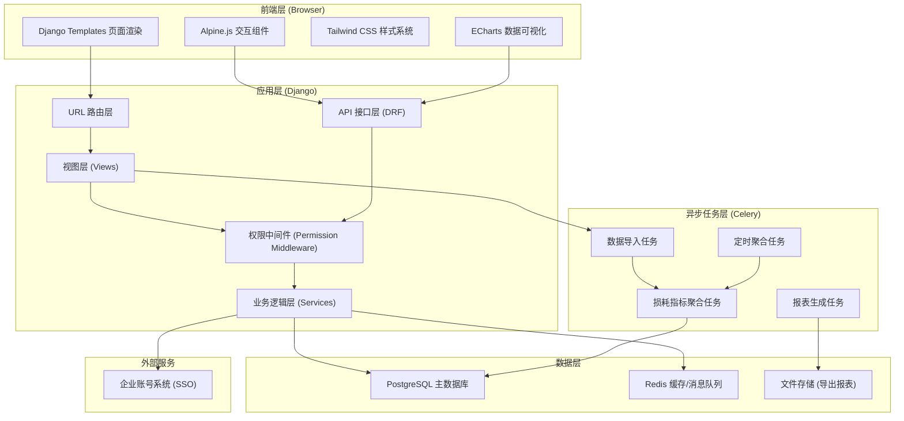
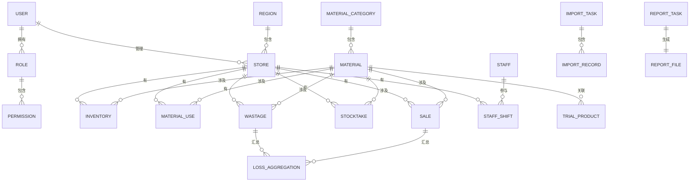
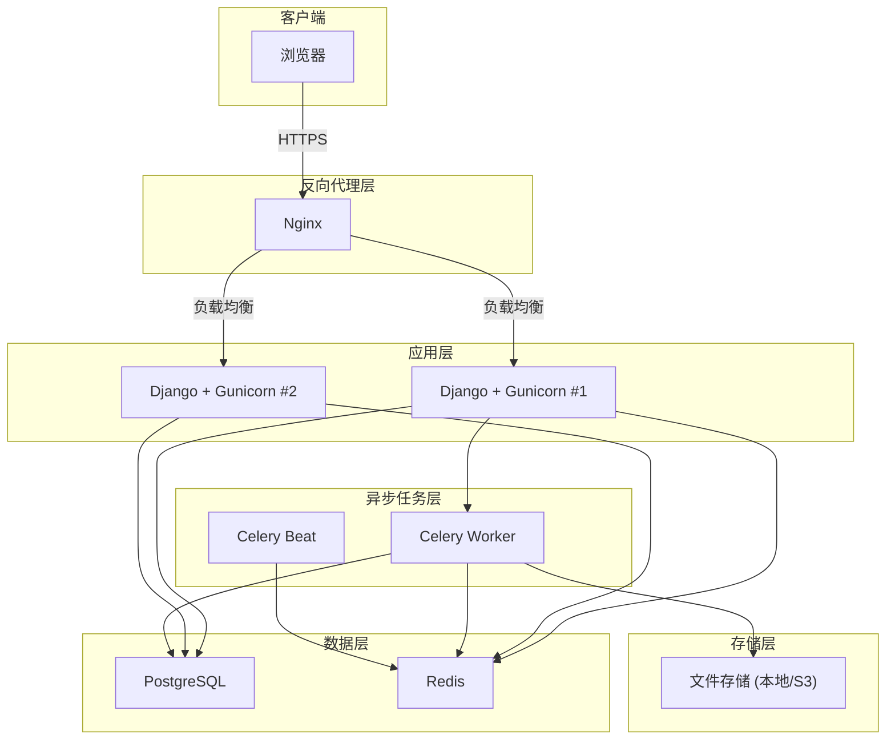

## 1. 架构设计



---

## 2. 技术栈说明

| 层级 | 技术选型 | 版本 | 用途 |
|------|----------|------|------|
| 后端框架 | Django | 4.2 LTS | Web框架，MVC架构，Admin管理后台 |
| API框架 | Django REST Framework | 3.14+ | 构建RESTful API，数据序列化 |
| 前端框架 | Alpine.js | 3.x | 轻量级响应式交互，无构建步骤 |
| 可视化 | ECharts | 5.4+ | 丰富图表类型，高性能渲染 |
| 样式框架 | Tailwind CSS | 3.3+ | 原子化CSS，快速构建UI |
| 异步任务 | Celery | 5.3+ | 异步数据处理、报表生成 |
| 消息队列 | Redis | 7.0+ | Celery Broker + 缓存层 |
| 数据库 | PostgreSQL | 14+ | 关系型数据库，支持复杂聚合查询 |
| 文件处理 | pandas + openpyxl | 最新 | Excel/CSV数据导入导出 |
| 认证 | Django Auth + 自定义权限 | - | 基于角色的权限控制(RBAC) |
| 部署 | Gunicorn + Nginx | - | 生产环境部署 |

---

## 3. 路由定义

| 路由路径 | 页面/接口 | 权限 | 说明 |
|---------|----------|------|------|
| `/` | 看板首页 | 登录用户 | 数据看板主页面 |
| `/dashboard/` | 看板首页 | 登录用户 | 同上（别名） |
| `/details/` | 损耗明细页 | 登录用户 | 明细数据列表与下钻 |
| `/data-management/` | 数据管理页 | 总部管理员 | 数据导入、口径配置、试营管理 |
| `/reports/` | 报表导出页 | 登录用户 | 报表生成与导出记录 |
| `/api/v1/dashboard/metrics/` | 看板指标API | 登录用户 | 获取核心指标数据 |
| `/api/v1/dashboard/trend/` | 趋势图API | 登录用户 | 获取损耗率趋势数据 |
| `/api/v1/dashboard/ranking/` | 排行榜API | 登录用户 | 获取异常门店/原料排行 |
| `/api/v1/loss/list/` | 损耗明细列表API | 登录用户 | 分页查询损耗明细 |
| `/api/v1/loss/<id>/trace/` | 数据溯源API | 登录用户 | 获取单条记录关联数据 |
| `/api/v1/import/upload/` | 数据导入API | 总部管理员 | 上传数据文件 |
| `/api/v1/import/status/<task_id>/` | 导入状态API | 总部管理员 | 查询异步任务进度 |
| `/api/v1/config/caliber/` | 口径配置API | 总部管理员 | 损耗率公式配置 |
| `/api/v1/trial-products/` | 试营原料API | 总部管理员 | 试营原料CRUD |
| `/api/v1/reports/generate/` | 报表生成API | 登录用户 | 触发生成报表任务 |
| `/api/v1/reports/list/` | 报表列表API | 登录用户 | 导出记录列表 |
| `/api/v1/reports/<id>/download/` | 报表下载API | 登录用户 | 下载生成的报表 |

---

## 4. 数据模型设计

### 4.1 ER图



### 4.2 核心表结构

```sql
-- 组织架构
CREATE TABLE region (
    id SERIAL PRIMARY KEY,
    name VARCHAR(100) NOT NULL,
    code VARCHAR(50) UNIQUE NOT NULL,
    created_at TIMESTAMP DEFAULT CURRENT_TIMESTAMP
);

CREATE TABLE store (
    id SERIAL PRIMARY KEY,
    name VARCHAR(100) NOT NULL,
    code VARCHAR(50) UNIQUE NOT NULL,
    region_id INTEGER REFERENCES region(id),
    address VARCHAR(255),
    is_active BOOLEAN DEFAULT TRUE,
    created_at TIMESTAMP DEFAULT CURRENT_TIMESTAMP
);

-- 用户与权限
CREATE TABLE role (
    id SERIAL PRIMARY KEY,
    name VARCHAR(50) UNIQUE NOT NULL,
    description TEXT
);

CREATE TABLE user_profile (
    id SERIAL PRIMARY KEY,
    user_id INTEGER REFERENCES auth_user(id) UNIQUE,
    role_id INTEGER REFERENCES role(id),
    store_id INTEGER REFERENCES store(id),
    region_id INTEGER REFERENCES region(id),
    phone VARCHAR(20),
    created_at TIMESTAMP DEFAULT CURRENT_TIMESTAMP
);

-- 原料主数据
CREATE TABLE material_category (
    id SERIAL PRIMARY KEY,
    name VARCHAR(100) NOT NULL,
    parent_id INTEGER REFERENCES material_category(id),
    sort_order INTEGER DEFAULT 0
);

CREATE TABLE material (
    id SERIAL PRIMARY KEY,
    name VARCHAR(100) NOT NULL,
    code VARCHAR(50) UNIQUE NOT NULL,
    category_id INTEGER REFERENCES material_category(id),
    unit VARCHAR(20) NOT NULL,
    unit_price DECIMAL(10,2) NOT NULL,
    is_trial BOOLEAN DEFAULT FALSE,
    created_at TIMESTAMP DEFAULT CURRENT_TIMESTAMP
);

-- 试营原料管理
CREATE TABLE trial_product (
    id SERIAL PRIMARY KEY,
    material_id INTEGER REFERENCES material(id) UNIQUE,
    start_date DATE NOT NULL,
    end_date DATE,
    store_ids INTEGER[] DEFAULT '{}',
    remark TEXT,
    created_at TIMESTAMP DEFAULT CURRENT_TIMESTAMP
);

-- 业务数据表
CREATE TABLE inventory (
    id SERIAL PRIMARY KEY,
    store_id INTEGER REFERENCES store(id),
    material_id INTEGER REFERENCES material(id),
    quantity DECIMAL(12,2) NOT NULL,
    unit_price DECIMAL(10,2) NOT NULL,
    total_amount DECIMAL(14,2) NOT NULL,
    record_date DATE NOT NULL,
    batch_no VARCHAR(50),
    created_at TIMESTAMP DEFAULT CURRENT_TIMESTAMP
);

CREATE TABLE material_use (
    id SERIAL PRIMARY KEY,
    store_id INTEGER REFERENCES store(id),
    material_id INTEGER REFERENCES material(id),
    quantity DECIMAL(12,2) NOT NULL,
    shift VARCHAR(20),
    record_date DATE NOT NULL,
    operator_id INTEGER REFERENCES auth_user(id),
    created_at TIMESTAMP DEFAULT CURRENT_TIMESTAMP
);

CREATE TABLE wastage (
    id SERIAL PRIMARY KEY,
    store_id INTEGER REFERENCES store(id),
    material_id INTEGER REFERENCES material(id),
    quantity DECIMAL(12,2) NOT NULL,
    unit_price DECIMAL(10,2) NOT NULL,
    total_amount DECIMAL(14,2) NOT NULL,
    reason VARCHAR(200),
    shift VARCHAR(20),
    record_date DATE NOT NULL,
    operator_id INTEGER REFERENCES auth_user(id),
    created_at TIMESTAMP DEFAULT CURRENT_TIMESTAMP
);

CREATE TABLE stocktake (
    id SERIAL PRIMARY KEY,
    store_id INTEGER REFERENCES store(id),
    material_id INTEGER REFERENCES material(id),
    system_quantity DECIMAL(12,2) NOT NULL,
    actual_quantity DECIMAL(12,2) NOT NULL,
    diff_quantity DECIMAL(12,2) NOT NULL,
    diff_amount DECIMAL(14,2) NOT NULL,
    shift VARCHAR(20),
    record_date DATE NOT NULL,
    created_at TIMESTAMP DEFAULT CURRENT_TIMESTAMP
);

CREATE TABLE sale (
    id SERIAL PRIMARY KEY,
    store_id INTEGER REFERENCES store(id),
    product_name VARCHAR(100),
    material_id INTEGER REFERENCES material(id),
    quantity DECIMAL(12,2) NOT NULL,
    material_consume DECIMAL(12,2) NOT NULL,
    sale_amount DECIMAL(14,2) NOT NULL,
    shift VARCHAR(20),
    sale_date DATE NOT NULL,
    created_at TIMESTAMP DEFAULT CURRENT_TIMESTAMP
);

-- 员工班次
CREATE TABLE staff (
    id SERIAL PRIMARY KEY,
    name VARCHAR(50) NOT NULL,
    store_id INTEGER REFERENCES store(id),
    position VARCHAR(50),
    phone VARCHAR(20),
    is_active BOOLEAN DEFAULT TRUE
);

CREATE TABLE staff_shift (
    id SERIAL PRIMARY KEY,
    staff_id INTEGER REFERENCES staff(id),
    store_id INTEGER REFERENCES store(id),
    shift_type VARCHAR(20) NOT NULL,
    shift_date DATE NOT NULL,
    start_time TIME,
    end_time TIME,
    created_at TIMESTAMP DEFAULT CURRENT_TIMESTAMP
);

-- 损耗聚合表（预计算，提升查询性能）
CREATE TABLE loss_aggregation (
    id SERIAL PRIMARY KEY,
    store_id INTEGER REFERENCES store(id),
    material_id INTEGER REFERENCES material(id),
    period_type VARCHAR(20) NOT NULL,
    period_date DATE NOT NULL,
    shift VARCHAR(20),
    total_use DECIMAL(14,2) DEFAULT 0,
    total_wastage DECIMAL(14,2) DEFAULT 0,
    total_stocktake_diff DECIMAL(14,2) DEFAULT 0,
    total_sale_consume DECIMAL(14,2) DEFAULT 0,
    loss_rate DECIMAL(8,4) DEFAULT 0,
    loss_amount DECIMAL(14,2) DEFAULT 0,
    includes_trial BOOLEAN DEFAULT TRUE,
    created_at TIMESTAMP DEFAULT CURRENT_TIMESTAMP,
    UNIQUE(store_id, material_id, period_type, period_date, shift, includes_trial)
);

-- 配置表
CREATE TABLE caliber_config (
    id SERIAL PRIMARY KEY,
    key VARCHAR(50) UNIQUE NOT NULL,
    value TEXT NOT NULL,
    description TEXT,
    updated_at TIMESTAMP DEFAULT CURRENT_TIMESTAMP
);

-- 数据导入任务
CREATE TABLE import_task (
    id SERIAL PRIMARY KEY,
    task_id VARCHAR(100) UNIQUE NOT NULL,
    user_id INTEGER REFERENCES auth_user(id),
    file_name VARCHAR(255) NOT NULL,
    data_type VARCHAR(50) NOT NULL,
    status VARCHAR(20) DEFAULT 'pending',
    total_rows INTEGER DEFAULT 0,
    success_rows INTEGER DEFAULT 0,
    failed_rows INTEGER DEFAULT 0,
    error_log TEXT,
    created_at TIMESTAMP DEFAULT CURRENT_TIMESTAMP
);

-- 报表导出
CREATE TABLE report_task (
    id SERIAL PRIMARY KEY,
    task_id VARCHAR(100) UNIQUE NOT NULL,
    user_id INTEGER REFERENCES auth_user(id),
    report_type VARCHAR(50) NOT NULL,
    filters JSONB,
    exclude_trial BOOLEAN DEFAULT FALSE,
    status VARCHAR(20) DEFAULT 'pending',
    file_path VARCHAR(255),
    created_at TIMESTAMP DEFAULT CURRENT_TIMESTAMP
);

-- 索引优化
CREATE INDEX idx_loss_agg_store_period ON loss_aggregation(store_id, period_type, period_date);
CREATE INDEX idx_loss_agg_material ON loss_aggregation(material_id);
CREATE INDEX idx_wastage_store_date ON wastage(store_id, record_date);
CREATE INDEX idx_sale_store_date ON sale(store_id, sale_date);
```

---

## 5. API 响应格式规范

### 5.1 统一响应结构

```typescript
interface ApiResponse<T> {
  code: number;
  message: string;
  data: T;
}

interface PaginatedResponse<T> {
  count: number;
  next: string | null;
  previous: string | null;
  results: T[];
}
```

### 5.2 核心数据类型定义

```typescript
// 核心指标
interface DashboardMetrics {
  totalLossRate: number;
  totalLossAmount: number;
  abnormalStoreCount: number;
  trialMaterialRatio: number;
  comparedToLastPeriod: {
    lossRate: number;
    lossAmount: number;
  };
}

// 趋势数据点
interface TrendDataPoint {
  date: string;
  lossRate: number;
  lossAmount: number;
  storeId?: number;
  storeName?: string;
}

// 排行榜项
interface RankingItem {
  id: number;
  name: string;
  lossRate: number;
  lossAmount: number;
  rank: number;
  isAbnormal: boolean;
  hasTrialMaterial: boolean;
}

// 损耗明细
interface LossDetail {
  id: number;
  storeName: string;
  materialName: string;
  materialCode: string;
  categoryName: string;
  quantity: number;
  unit: string;
  unitPrice: number;
  totalAmount: number;
  lossType: 'wastage' | 'stocktake_diff';
  reason: string;
  shift: string;
  recordDate: string;
  isTrial: boolean;
}

// 筛选条件
interface FilterParams {
  storeIds: number[];
  categoryIds: number[];
  materialIds: number[];
  startDate: string;
  endDate: string;
  shift: string;
  excludeTrial: boolean;
}
```

---

## 6. 服务器架构图


