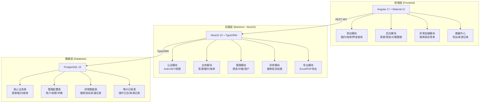
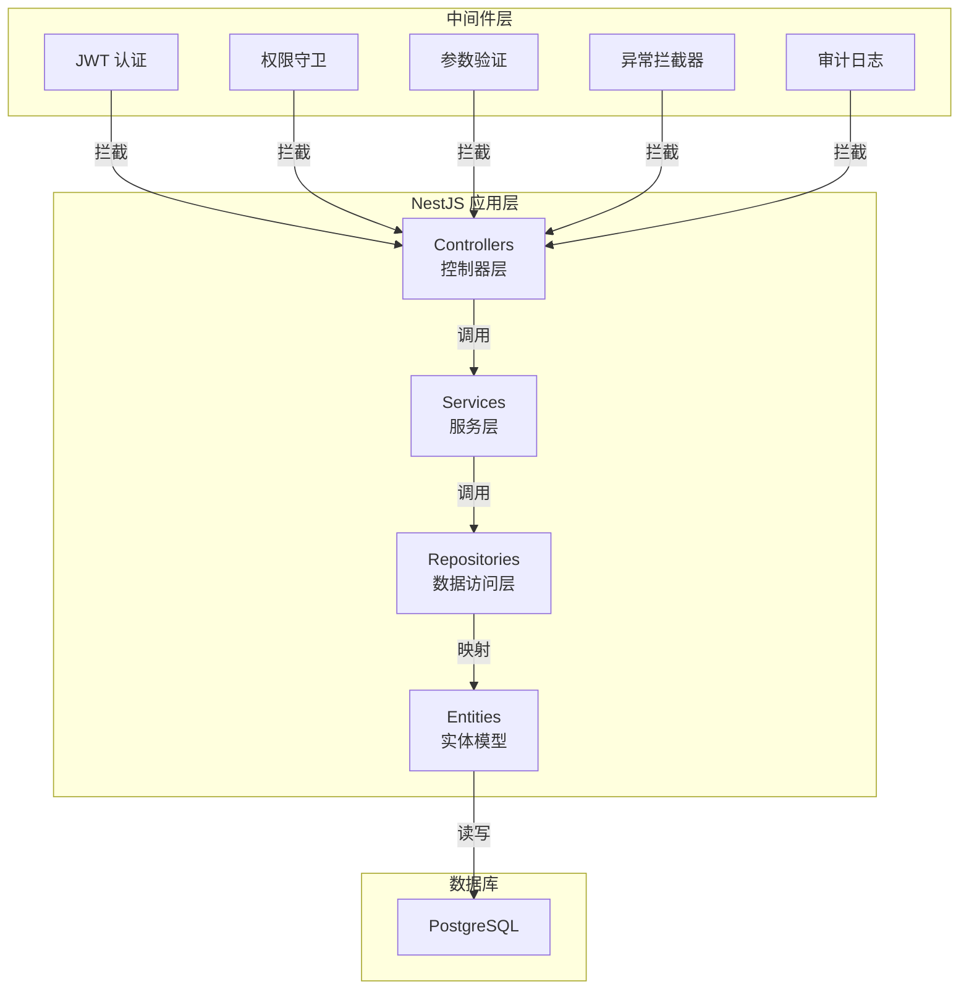
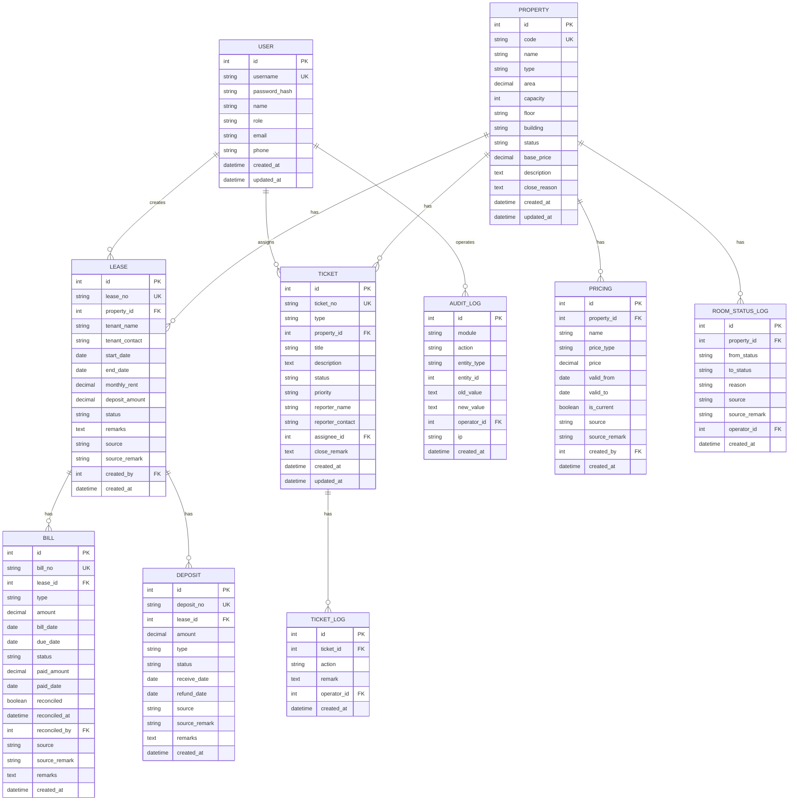

## 1. 架构设计



## 2. 技术选型说明

- **前端框架**：Angular 17 + Angular Material (Material UI)
  - 组件库：@angular/material
  - 状态管理：RxJS + Angular Services
  - 路由：Angular Router
  - 表单：Angular Reactive Forms
  - 图表：ngx-charts 或 @angular/material/datepicker
  - 构建工具：Angular CLI
- **后端框架**：NestJS 10 + TypeORM
  - ORM：TypeORM
  - 认证：@nestjs/jwt + @nestjs/passport
  - 验证：class-validator + class-transformer
  - 文件导出：exceljs + pdfkit
- **数据库**：PostgreSQL 15
  - 支持 JSONB 字段存储扩展信息
  - 支持全文检索
  - 支持复杂查询与事务

## 3. 路由定义

### 3.1 前端路由

| 路由路径 | 页面名称 | 模块 | 权限要求 |
|----------|----------|------|----------|
| /login | 登录页 | 认证 | 公开 |
| /dashboard | 工作台首页 | 前台 | 已登录 |
| /leases | 租约查询 | 前台 | 财务/管理员 |
| /bills | 账单管理 | 前台 | 财务/管理员 |
| /deposits | 押金记录 | 前台 | 财务/管理员 |
| /properties | 房源档案 | 后台 | 管理员 |
| /room-status | 房态管理 | 后台 | 管理员 |
| /pricing | 价格管理 | 后台 | 管理员 |
| /tickets | 维修投诉 | 异常 | 管理员/财务 |
| /export | 数据导出 | 数据 | 财务/管理员 |
| /settings | 系统设置 | 系统 | 管理员 |

### 3.2 后端 API 路由

| 方法 | 路由 | 功能 | 模块 |
|------|------|------|------|
| POST | /api/auth/login | 用户登录 | 认证 |
| GET | /api/auth/profile | 获取当前用户 | 认证 |
| GET | /api/properties | 房源列表 | 房源 |
| GET | /api/properties/:id | 房源详情 | 房源 |
| POST | /api/properties | 新增房源 | 房源 |
| PUT | /api/properties/:id | 编辑房源 | 房源 |
| DELETE | /api/properties/:id | 删除房源 | 房源 |
| GET | /api/leases | 租约列表 | 租约 |
| GET | /api/leases/:id | 租约详情 | 租约 |
| GET | /api/bills | 账单列表 | 账单 |
| GET | /api/bills/:id | 账单详情 | 账单 |
| PUT | /api/bills/:id/reconcile | 标记对账 | 账单 |
| GET | /api/deposits | 押金记录列表 | 押金 |
| GET | /api/room-status | 房态列表 | 房态 |
| PUT | /api/room-status/:id | 更新房态 | 房态 |
| GET | /api/pricing | 价格方案列表 | 价格 |
| POST | /api/pricing | 新增价格方案 | 价格 |
| GET | /api/tickets | 工单列表 | 异常 |
| POST | /api/tickets | 创建工单 | 异常 |
| PUT | /api/tickets/:id | 更新工单状态 | 异常 |
| POST | /api/export | 数据导出 | 导出 |
| GET | /api/audit-logs | 操作日志 | 审计 |

## 4. API 类型定义

```typescript
// 通用响应
interface ApiResponse<T> {
  success: boolean;
  data: T;
  message?: string;
}

interface PaginatedResponse<T> {
  items: T[];
  total: number;
  page: number;
  pageSize: number;
}

// 用户
interface User {
  id: number;
  username: string;
  name: string;
  role: 'finance' | 'admin' | 'auditor';
  email?: string;
  phone?: string;
  createdAt: Date;
}

// 房源
interface Property {
  id: number;
  code: string;
  name: string;
  type: 'private_office' | 'hot_desk' | 'meeting_room' | 'long_term';
  area: number;
  capacity: number;
  floor: string;
  building: string;
  status: 'vacant' | 'rented' | 'maintenance' | 'closed';
  basePrice: number;
  description?: string;
  closeReason?: string;
  createdAt: Date;
  updatedAt: Date;
}

// 租约
interface Lease {
  id: number;
  leaseNo: string;
  propertyId: number;
  property: Property;
  tenantName: string;
  tenantContact: string;
  startDate: Date;
  endDate: Date;
  monthlyRent: number;
  depositAmount: number;
  status: 'active' | 'expired' | 'terminated';
  remarks?: string;
  source: string;
  sourceRemark?: string;
  createdAt: Date;
  createdBy: number;
}

// 账单
interface Bill {
  id: number;
  billNo: string;
  leaseId: number;
  lease: Lease;
  type: 'rent' | 'deposit' | 'service' | 'other';
  amount: number;
  billDate: Date;
  dueDate: Date;
  status: 'unpaid' | 'paid' | 'partial' | 'void';
  paidAmount?: number;
  paidDate?: Date;
  reconciled: boolean;
  reconciledAt?: Date;
  reconciledBy?: number;
  source: string;
  sourceRemark?: string;
  remarks?: string;
  createdAt: Date;
}

// 押金记录
interface Deposit {
  id: number;
  depositNo: string;
  leaseId: number;
  lease: Lease;
  amount: number;
  type: 'received' | 'refunded' | 'deducted';
  status: 'active' | 'refunded' | 'deducted';
  receiveDate?: Date;
  refundDate?: Date;
  source: string;
  sourceRemark?: string;
  remarks?: string;
  createdAt: Date;
}

// 房态记录
interface RoomStatusLog {
  id: number;
  propertyId: number;
  property: Property;
  fromStatus: string;
  toStatus: string;
  reason: string;
  source: string;
  sourceRemark?: string;
  operatorId: number;
  operator: User;
  createdAt: Date;
}

// 价格方案
interface Pricing {
  id: number;
  propertyId: number;
  property: Property;
  name: string;
  priceType: 'daily' | 'weekly' | 'monthly' | 'yearly';
  price: number;
  validFrom: Date;
  validTo?: Date;
  isCurrent: boolean;
  source: string;
  sourceRemark?: string;
  createdAt: Date;
  createdBy: number;
}

// 维修投诉工单
interface Ticket {
  id: number;
  ticketNo: string;
  type: 'maintenance' | 'complaint';
  propertyId: number;
  property: Property;
  title: string;
  description: string;
  status: 'pending' | 'processing' | 'completed' | 'closed';
  priority: 'low' | 'medium' | 'high';
  reporterName: string;
  reporterContact: string;
  assigneeId?: number;
  assignee?: User;
  closeRemark?: string;
  createdAt: Date;
  updatedAt: Date;
}

// 工单处理记录
interface TicketLog {
  id: number;
  ticketId: number;
  action: string;
  remark: string;
  operatorId: number;
  operator: User;
  createdAt: Date;
}

// 审计日志
interface AuditLog {
  id: number;
  module: string;
  action: string;
  entityType: string;
  entityId: number;
  oldValue?: string;
  newValue?: string;
  operatorId: number;
  operator: User;
  ip?: string;
  createdAt: Date;
}
```

## 5. 服务端架构图



## 6. 数据模型

### 6.1 ER 图



### 6.2 DDL 语句

```sql
-- 用户表
CREATE TABLE users (
    id SERIAL PRIMARY KEY,
    username VARCHAR(50) UNIQUE NOT NULL,
    password_hash VARCHAR(255) NOT NULL,
    name VARCHAR(100) NOT NULL,
    role VARCHAR(20) NOT NULL DEFAULT 'finance',
    email VARCHAR(100),
    phone VARCHAR(20),
    created_at TIMESTAMP NOT NULL DEFAULT CURRENT_TIMESTAMP,
    updated_at TIMESTAMP NOT NULL DEFAULT CURRENT_TIMESTAMP
);

-- 房源表
CREATE TABLE properties (
    id SERIAL PRIMARY KEY,
    code VARCHAR(50) UNIQUE NOT NULL,
    name VARCHAR(100) NOT NULL,
    type VARCHAR(20) NOT NULL,
    area DECIMAL(10,2),
    capacity INTEGER,
    floor VARCHAR(20),
    building VARCHAR(50),
    status VARCHAR(20) NOT NULL DEFAULT 'vacant',
    base_price DECIMAL(12,2) NOT NULL DEFAULT 0,
    description TEXT,
    close_reason TEXT,
    created_at TIMESTAMP NOT NULL DEFAULT CURRENT_TIMESTAMP,
    updated_at TIMESTAMP NOT NULL DEFAULT CURRENT_TIMESTAMP
);

CREATE INDEX idx_properties_status ON properties(status);
CREATE INDEX idx_properties_type ON properties(type);

-- 租约表
CREATE TABLE leases (
    id SERIAL PRIMARY KEY,
    lease_no VARCHAR(50) UNIQUE NOT NULL,
    property_id INTEGER NOT NULL REFERENCES properties(id),
    tenant_name VARCHAR(100) NOT NULL,
    tenant_contact VARCHAR(50),
    start_date DATE NOT NULL,
    end_date DATE NOT NULL,
    monthly_rent DECIMAL(12,2) NOT NULL,
    deposit_amount DECIMAL(12,2) NOT NULL DEFAULT 0,
    status VARCHAR(20) NOT NULL DEFAULT 'active',
    remarks TEXT,
    source VARCHAR(50) NOT NULL DEFAULT 'system',
    source_remark VARCHAR(255),
    created_by INTEGER REFERENCES users(id),
    created_at TIMESTAMP NOT NULL DEFAULT CURRENT_TIMESTAMP
);

CREATE INDEX idx_leases_property_id ON leases(property_id);
CREATE INDEX idx_leases_status ON leases(status);
CREATE INDEX idx_leases_tenant_name ON leases(tenant_name);
CREATE INDEX idx_leases_date_range ON leases(start_date, end_date);

-- 账单表
CREATE TABLE bills (
    id SERIAL PRIMARY KEY,
    bill_no VARCHAR(50) UNIQUE NOT NULL,
    lease_id INTEGER NOT NULL REFERENCES leases(id),
    type VARCHAR(20) NOT NULL,
    amount DECIMAL(12,2) NOT NULL,
    bill_date DATE NOT NULL,
    due_date DATE,
    status VARCHAR(20) NOT NULL DEFAULT 'unpaid',
    paid_amount DECIMAL(12,2) DEFAULT 0,
    paid_date DATE,
    reconciled BOOLEAN NOT NULL DEFAULT false,
    reconciled_at TIMESTAMP,
    reconciled_by INTEGER REFERENCES users(id),
    source VARCHAR(50) NOT NULL DEFAULT 'system',
    source_remark VARCHAR(255),
    remarks TEXT,
    created_at TIMESTAMP NOT NULL DEFAULT CURRENT_TIMESTAMP
);

CREATE INDEX idx_bills_lease_id ON bills(lease_id);
CREATE INDEX idx_bills_status ON bills(status);
CREATE INDEX idx_bills_bill_date ON bills(bill_date);
CREATE INDEX idx_bills_reconciled ON bills(reconciled);

-- 押金记录表
CREATE TABLE deposits (
    id SERIAL PRIMARY KEY,
    deposit_no VARCHAR(50) UNIQUE NOT NULL,
    lease_id INTEGER NOT NULL REFERENCES leases(id),
    amount DECIMAL(12,2) NOT NULL,
    type VARCHAR(20) NOT NULL,
    status VARCHAR(20) NOT NULL DEFAULT 'active',
    receive_date DATE,
    refund_date DATE,
    source VARCHAR(50) NOT NULL DEFAULT 'system',
    source_remark VARCHAR(255),
    remarks TEXT,
    created_at TIMESTAMP NOT NULL DEFAULT CURRENT_TIMESTAMP
);

CREATE INDEX idx_deposits_lease_id ON deposits(lease_id);
CREATE INDEX idx_deposits_status ON deposits(status);

-- 价格方案表
CREATE TABLE pricings (
    id SERIAL PRIMARY KEY,
    property_id INTEGER NOT NULL REFERENCES properties(id),
    name VARCHAR(100) NOT NULL,
    price_type VARCHAR(20) NOT NULL,
    price DECIMAL(12,2) NOT NULL,
    valid_from DATE NOT NULL,
    valid_to DATE,
    is_current BOOLEAN NOT NULL DEFAULT false,
    source VARCHAR(50) NOT NULL DEFAULT 'system',
    source_remark VARCHAR(255),
    created_by INTEGER REFERENCES users(id),
    created_at TIMESTAMP NOT NULL DEFAULT CURRENT_TIMESTAMP
);

CREATE INDEX idx_pricings_property_id ON pricings(property_id);
CREATE INDEX idx_pricings_is_current ON pricings(is_current);

-- 房态变更记录表
CREATE TABLE room_status_logs (
    id SERIAL PRIMARY KEY,
    property_id INTEGER NOT NULL REFERENCES properties(id),
    from_status VARCHAR(20),
    to_status VARCHAR(20) NOT NULL,
    reason VARCHAR(255),
    source VARCHAR(50) NOT NULL DEFAULT 'system',
    source_remark VARCHAR(255),
    operator_id INTEGER REFERENCES users(id),
    created_at TIMESTAMP NOT NULL DEFAULT CURRENT_TIMESTAMP
);

CREATE INDEX idx_room_status_logs_property_id ON room_status_logs(property_id);
CREATE INDEX idx_room_status_logs_created_at ON room_status_logs(created_at);

-- 工单表（维修/投诉）
CREATE TABLE tickets (
    id SERIAL PRIMARY KEY,
    ticket_no VARCHAR(50) UNIQUE NOT NULL,
    type VARCHAR(20) NOT NULL,
    property_id INTEGER NOT NULL REFERENCES properties(id),
    title VARCHAR(200) NOT NULL,
    description TEXT,
    status VARCHAR(20) NOT NULL DEFAULT 'pending',
    priority VARCHAR(20) NOT NULL DEFAULT 'medium',
    reporter_name VARCHAR(100) NOT NULL,
    reporter_contact VARCHAR(50),
    assignee_id INTEGER REFERENCES users(id),
    close_remark TEXT,
    created_at TIMESTAMP NOT NULL DEFAULT CURRENT_TIMESTAMP,
    updated_at TIMESTAMP NOT NULL DEFAULT CURRENT_TIMESTAMP
);

CREATE INDEX idx_tickets_status ON tickets(status);
CREATE INDEX idx_tickets_type ON tickets(type);
CREATE INDEX idx_tickets_property_id ON tickets(property_id);
CREATE INDEX idx_tickets_assignee_id ON tickets(assignee_id);

-- 工单处理记录表
CREATE TABLE ticket_logs (
    id SERIAL PRIMARY KEY,
    ticket_id INTEGER NOT NULL REFERENCES tickets(id),
    action VARCHAR(50) NOT NULL,
    remark TEXT,
    operator_id INTEGER REFERENCES users(id),
    created_at TIMESTAMP NOT NULL DEFAULT CURRENT_TIMESTAMP
);

CREATE INDEX idx_ticket_logs_ticket_id ON ticket_logs(ticket_id);

-- 审计日志表
CREATE TABLE audit_logs (
    id SERIAL PRIMARY KEY,
    module VARCHAR(50) NOT NULL,
    action VARCHAR(50) NOT NULL,
    entity_type VARCHAR(50) NOT NULL,
    entity_id INTEGER NOT NULL,
    old_value TEXT,
    new_value TEXT,
    operator_id INTEGER REFERENCES users(id),
    ip VARCHAR(50),
    created_at TIMESTAMP NOT NULL DEFAULT CURRENT_TIMESTAMP
);

CREATE INDEX idx_audit_logs_entity ON audit_logs(entity_type, entity_id);
CREATE INDEX idx_audit_logs_operator ON audit_logs(operator_id);
CREATE INDEX idx_audit_logs_created_at ON audit_logs(created_at);

-- 初始数据：默认管理员
INSERT INTO users (username, password_hash, name, role) VALUES
('admin', '$2b$10$default_hash_change_in_production', '系统管理员', 'admin'),
('finance', '$2b$10$default_hash_change_in_production', '财务专员', 'finance'),
('auditor', '$2b$10$default_hash_change_in_production', '对账人员', 'auditor');
```
