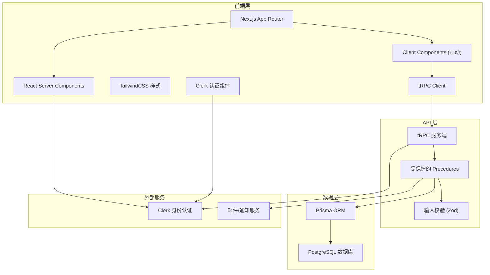
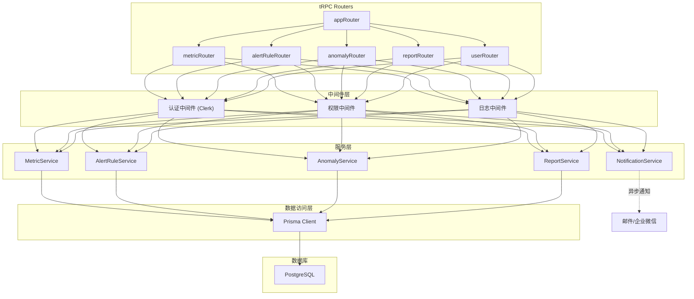
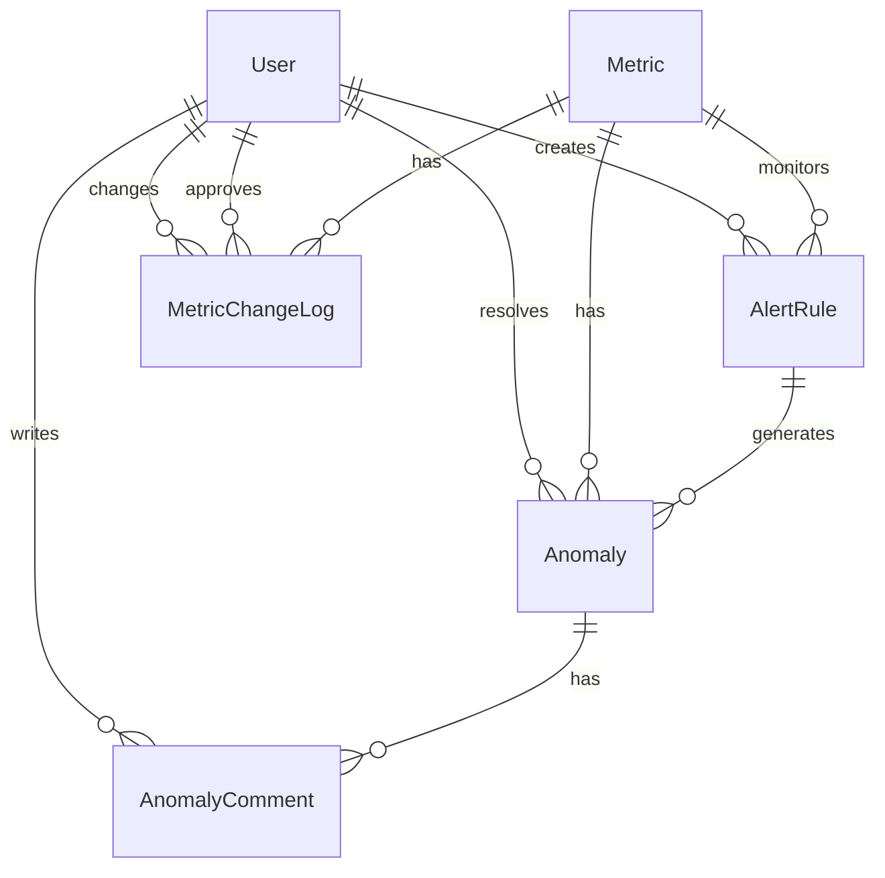

## 1. 架构设计



## 2. 技术描述

- **前端框架**：Next.js 14 (App Router) + React 18 + TypeScript
- **样式方案**：TailwindCSS 3 + CSS Variables
- **状态管理**：Zustand (客户端状态) + React Server Components (服务端状态)
- **图表库**：Recharts (React 图表组件)
- **图标库**：Lucide React
- **API 层**：tRPC 10 + Zod 输入校验
- **ORM**：Prisma 5
- **数据库**：PostgreSQL 15
- **身份认证**：Clerk
- **开发语言**：TypeScript 5
- **包管理**：pnpm
- **代码规范**：ESLint + Prettier

## 3. 路由定义

| 路由 | 页面 | 权限 | 说明 |
|------|------|------|------|
| / | 监控看板 | 登录用户 | 首页，指标概览和异常统计 |
| /dashboard | 监控看板 | 登录用户 | 同首页 |
| /alerts/rules | 告警规则列表 | 销售总监/数据运营 | 管理告警规则 |
| /alerts/rules/new | 新建告警规则 | 销售总监 | 向导式配置 |
| /alerts/rules/[id] | 编辑告警规则 | 销售总监 | 编辑已有规则 |
| /anomalies | 异常中心 | 登录用户 | 异常列表和筛选 |
| /anomalies/[id] | 异常详情 | 登录用户 | 异常数据、原因分析、处理记录 |
| /reports | 报表复盘 | 销售总监/数据运营 | 月度报表和口径变更日志 |
| /settings | 系统设置 | 销售总监 | 权限管理和指标字典 |
| /settings/metrics | 指标字典 | 数据运营 | 指标口径维护 |
| /settings/permissions | 权限管理 | 销售总监 | 角色和用户权限 |
| /sign-in | 登录页 | 公开 | Clerk 登录 |
| /sign-up | 注册页 | 公开 | Clerk 注册 |

## 4. API 定义 (tRPC Procedures)

### 4.1 指标相关

```typescript
// 类型定义
interface Metric {
  id: string;
  name: string;
  code: string;
  description: string;
  formula: string;
  dataSource: string;
  unit: string;
  category: string;
  createdAt: Date;
  updatedAt: Date;
}

interface MetricDataPoint {
  date: string;
  value: number;
  period: 'day' | 'week' | 'month';
}

// Procedures
metric.list: () => Metric[]
metric.getById: (id: string) => Metric
metric.getData: (input: { metricId: string; startDate: Date; endDate: Date; period: 'day' | 'week' | 'month' }) => MetricDataPoint[]
metric.create: (input: CreateMetricInput) => Metric
metric.update: (input: UpdateMetricInput) => Metric
metric.delete: (id: string) => void
```

### 4.2 告警规则相关

```typescript
// 类型定义
interface AlertRule {
  id: string;
  name: string;
  metricId: string;
  metric: Metric;
  period: 'day' | 'week' | 'month';
  thresholdType: 'absolute' | 'percentage';
  thresholdValue: number;
  direction: 'above' | 'below' | 'both';
  severity: 'low' | 'medium' | 'high' | 'critical';
  channels: AlertChannel[];
  isEnabled: boolean;
  createdBy: string;
  createdAt: Date;
  updatedAt: Date;
}

interface AlertChannel {
  type: 'in_app' | 'email' | 'wework';
  recipients: string[];
}

// Procedures
alertRule.list: (input?: { isEnabled?: boolean }) => AlertRule[]
alertRule.getById: (id: string) => AlertRule
alertRule.create: (input: CreateAlertRuleInput) => AlertRule
alertRule.update: (input: UpdateAlertRuleInput) => AlertRule
alertRule.delete: (id: string) => void
alertRule.toggle: (id: string, isEnabled: boolean) => AlertRule
```

### 4.3 异常告警相关

```typescript
// 类型定义
interface Anomaly {
  id: string;
  alertRuleId: string;
  alertRule: AlertRule;
  metricId: string;
  metric: Metric;
  detectedAt: Date;
  periodStart: Date;
  periodEnd: Date;
  actualValue: number;
  expectedValue: number;
  deviation: number;
  deviationPercentage: number;
  severity: 'low' | 'medium' | 'high' | 'critical';
  status: 'open' | 'investigating' | 'resolved' | 'ignored';
  summary?: string;
  rootCause?: string;
  rootCauseCategory?: string;
  assignedTo?: string;
  resolvedAt?: Date;
  createdAt: Date;
  updatedAt: Date;
}

interface AnomalyComment {
  id: string;
  anomalyId: string;
  userId: string;
  userName: string;
  content: string;
  createdAt: Date;
}

// Procedures
anomaly.list: (input: { 
  status?: AnomalyStatus[];
  severity?: AnomalySeverity[];
  metricId?: string;
  startDate?: Date;
  endDate?: Date;
  page: number;
  pageSize: number;
}) => { items: Anomaly[]; total: number }

anomaly.getById: (id: string) => Anomaly & { comments: AnomalyComment[] }
anomaly.updateStatus: (input: { id: string; status: AnomalyStatus }) => Anomaly
anomaly.updateRootCause: (input: { id: string; rootCause: string; rootCauseCategory: string }) => Anomaly
anomaly.addComment: (input: { anomalyId: string; content: string }) => AnomalyComment
anomaly.getSummary: (input: { startDate: Date; endDate: Date }) => AnomalySummary
```

### 4.4 报表相关

```typescript
// 类型定义
interface MonthlyReport {
  month: string;
  totalAnomalies: number;
  resolvedAnomalies: number;
  avgResolutionTime: number; // 小时
  anomaliesBySeverity: Record<string, number>;
  anomaliesByMetric: Record<string, number>;
  topAnomalies: Anomaly[];
  metricChanges: MetricChangeLog[];
}

interface MetricChangeLog {
  id: string;
  metricId: string;
  metricName: string;
  fieldChanged: string;
  oldValue: string;
  newValue: string;
  changedBy: string;
  changedAt: Date;
  approvedBy?: string;
  approvedAt?: Date;
}

// Procedures
report.getMonthly: (month: string) => MonthlyReport
report.exportMonthly: (month: string) => string // 返回下载 URL
metricChangeLog.list: (metricId?: string) => MetricChangeLog[]
metricChangeLog.create: (input: CreateMetricChangeLogInput) => MetricChangeLog
metricChangeLog.approve: (id: string) => MetricChangeLog
```

## 5. 服务端架构



## 6. 数据模型

### 6.1 ER 图



### 6.2 Prisma Schema

```prisma
model User {
  id            String   @id @default(cuid())
  clerkId       String   @unique
  email         String   @unique
  name          String?
  role          UserRole @default(SALES_MANAGER)
  avatarUrl     String?
  createdAt     DateTime @default(now())
  updatedAt     DateTime @updatedAt
  
  alertRules    AlertRule[]
  assignedAnomalies Anomaly[] @relation("assignedAnomalies")
  comments      AnomalyComment[]
  createdMetricChanges MetricChangeLog[] @relation("createdChanges")
  approvedMetricChanges MetricChangeLog[] @relation("approvedChanges")
}

enum UserRole {
  SALES_DIRECTOR
  SALES_MANAGER
  DATA_OPERATOR
}

model Metric {
  id          String   @id @default(cuid())
  name        String
  code        String   @unique
  description String?
  formula     String?
  dataSource  String?
  unit        String
  category    String
  isActive    Boolean  @default(true)
  createdAt   DateTime @default(now())
  updatedAt   DateTime @updatedAt
  
  alertRules  AlertRule[]
  anomalies   Anomaly[]
  changeLogs  MetricChangeLog[]
}

model AlertRule {
  id             String   @id @default(cuid())
  name           String
  metricId       String
  metric         Metric   @relation(fields: [metricId], references: [id])
  period         AlertPeriod
  thresholdType  ThresholdType
  thresholdValue Float
  direction      AlertDirection
  severity       AlertSeverity
  channels       Json     // 告警渠道配置
  isEnabled      Boolean  @default(true)
  createdById    String
  createdBy      User     @relation(fields: [createdById], references: [id])
  createdAt      DateTime @default(now())
  updatedAt      DateTime @updatedAt
  
  anomalies      Anomaly[]
}

enum AlertPeriod {
  DAY
  WEEK
  MONTH
}

enum ThresholdType {
  ABSOLUTE
  PERCENTAGE
}

enum AlertDirection {
  ABOVE
  BELOW
  BOTH
}

enum AlertSeverity {
  LOW
  MEDIUM
  HIGH
  CRITICAL
}

model Anomaly {
  id                 String        @id @default(cuid())
  alertRuleId        String
  alertRule          AlertRule     @relation(fields: [alertRuleId], references: [id])
  metricId           String
  metric             Metric        @relation(fields: [metricId], references: [id])
  detectedAt         DateTime      @default(now())
  periodStart        DateTime
  periodEnd          DateTime
  actualValue        Float
  expectedValue      Float
  deviation          Float
  deviationPercentage Float
  severity           AlertSeverity
  status             AnomalyStatus @default(OPEN)
  summary            String?
  rootCause          String?
  rootCauseCategory  String?
  assignedToId       String?
  assignedTo         User?         @relation("assignedAnomalies", fields: [assignedToId], references: [id])
  resolvedAt         DateTime?
  createdAt          DateTime      @default(now())
  updatedAt          DateTime      @updatedAt
  
  comments           AnomalyComment[]
  
  @@index([status])
  @@index([severity])
  @@index([detectedAt])
}

enum AnomalyStatus {
  OPEN
  INVESTIGATING
  RESOLVED
  IGNORED
}

model AnomalyComment {
  id         String   @id @default(cuid())
  anomalyId  String
  anomaly    Anomaly  @relation(fields: [anomalyId], references: [id], onDelete: Cascade)
  userId     String
  user       User     @relation(fields: [userId], references: [id])
  content    String
  createdAt  DateTime @default(now())
  
  @@index([anomalyId])
}

model MetricChangeLog {
  id          String   @id @default(cuid())
  metricId    String
  metric      Metric   @relation(fields: [metricId], references: [id])
  fieldChanged String
  oldValue    String?
  newValue    String?
  createdById String
  createdBy   User     @relation("createdChanges", fields: [createdById], references: [id])
  createdAt   DateTime @default(now())
  approvedById String?
  approvedBy  User?    @relation("approvedChanges", fields: [approvedById], references: [id])
  approvedAt  DateTime?
  description String?
  
  @@index([metricId])
  @@index([createdAt])
}
```

## 7. 项目目录结构

```
├── src/
│   ├── app/                    # Next.js App Router
│   │   ├── (dashboard)/        # 仪表盘布局
│   │   │   ├── layout.tsx
│   │   │   ├── page.tsx        # 监控看板
│   │   │   ├── alerts/
│   │   │   │   └── rules/
│   │   │   ├── anomalies/
│   │   │   ├── reports/
│   │   │   └── settings/
│   │   ├── sign-in/
│   │   ├── sign-up/
│   │   └── api/
│   │       └── trpc/[trpc]/    # tRPC 端点
│   ├── server/                 # 服务端代码
│   │   ├── api/
│   │   │   ├── root.ts         # tRPC app router
│   │   │   ├── trpc.ts         # tRPC 初始化
│   │   │   ├── routers/
│   │   │   │   ├── metric.ts
│   │   │   │   ├── alertRule.ts
│   │   │   │   ├── anomaly.ts
│   │   │   │   └── report.ts
│   │   │   └── middlewares/
│   │   ├── services/           # 业务逻辑层
│   │   │   ├── metric.service.ts
│   │   │   ├── alert.service.ts
│   │   │   ├── anomaly.service.ts
│   │   │   └── report.service.ts
│   │   └── db.ts               # Prisma client
│   ├── components/             # React 组件
│   │   ├── dashboard/
│   │   ├── alerts/
│   │   ├── anomalies/
│   │   ├── reports/
│   │   ├── settings/
│   │   ├── layout/
│   │   └── ui/                 # 基础 UI 组件
│   ├── hooks/                  # 自定义 hooks
│   ├── store/                  # Zustand stores
│   ├── utils/                  # 工具函数
│   ├── types/                  # TypeScript 类型
│   └── styles/                 # 全局样式
├── prisma/
│   ├── schema.prisma
│   └── seed.ts                 # 种子数据
├── public/
├── .env.example
├── next.config.mjs
├── tailwind.config.ts
├── tsconfig.json
└── package.json
```
